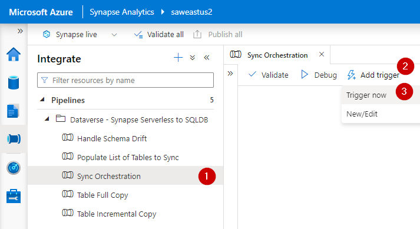

# Sync Dataverse data from Synapse Serverless to Azure SQL DB
 Extend Azure Synapse Link for Dataverse by syncing Dataverse data to an Azure SQL DB.

## Background and Problem Statement
[Microsoft Dataverse](https://docs.microsoft.com/en-us/power-apps/maker/data-platform/data-platform-intro) is a secure and versatile data storage and management layer for a variety of business applications, such as Microsoft Dynamics, Power Apps, Power Automate, etc. [Synapse Link for Dataverse](https://docs.microsoft.com/en-us/power-apps/maker/data-platform/export-to-data-lake) provides a seamless  mechanism for continuously exporting Dataverse data to your Synapse Analytics Workspace for integration, analytics and business intelligence purposes.

While data exported via Synapse Link for Dataverse can be accessed using Synapse Analytics Serverless SQL Pools, some customers may prefer to make Dataverse data available in an Azure SQL Database to support a broader range of data integration or data enrichment requirements. This scenario may be particularly relevant for customers who previously used the [Data Export Service (DES)](https://docs.microsoft.com/en-us/power-apps/developer/data-platform/data-export-service) to bring Dataverse data from their Microsoft Dynamics applications to their Azure SQL Database. 

The Data Export Service was deprecated in November 2021 and will reach its [end-of-support and end-of-life in November 2022](https://powerapps.microsoft.com/en-us/blog/do-more-with-data-from-data-export-service-to-azure-synapse-link-for-dataverse/). Synapse Link for Dataverse does not natively support an Azure SQL DB as the destination for data export. However, a flexible and scalable data integration solution can be implemented to copy Dataverse data from a Synapse Analytics Workspace an Azure SQL database as a replacement for the Data Export Service.

## Solution Overview
This repository includes a solution accelerator for incrementally synchronizing Dataverse data from external tables or views in Synapse Serverless SQL Pool to an Azure SQL Database. The solution consists of Synapse Pipelines for data movement, as well as database objects for configuration and logging of the data integration process. This solution can be rapidly deployed to dynamically synchronize any number of tables between a Serverless SQL Pool and an Azure SQL DB.

The architecture of this solution is depicted on the following diagram:


This solution supports copying tables either incrementally or in full. Most tables should be loaded incrementally. However, certain metadata tables, such as StateMetadata, StatusMetadata, OptionsetMetadata, GlobalOptionsetMetadata and TargetMetadata should be loaded in full (since they tend to be small and do not have relevant columns to indicate when specific records have been modified).

The solution keeps track of integration pipeline runs for each table and retrieves only those records that have been added or changed since the latest successful pipeline run.

In order to facilitate incremental copying of data, this solution requires table export in Synapse Link for Dataverse to be configured in *append-only mode* as described in the following [article](https://docs.microsoft.com/en-us/power-apps/maker/data-platform/azure-synapse-link-advanced-configuration#in-place-updates-vs-append-only-writes). Hence, data available in the Serverless SQL Pool may contain multiple versions of any given record, as that record evolves over time. However, this solution deduplicates the data in such a way that the destination Azure SQL Database contains only the latest version of any given record, which simplifies the consumption of the data.

Deleted records in incrementally copied tables are handled as soft deletes by adding a flag to the IsDelete column. If desired, database views can be added in the target SQL database to filter out the deleted records.

To avoid read/write contention issues while reading data from files that are being written to by Synapse Link for Dataverse, it is recommended to use data from [read-only hourly snapshots](https://docs.microsoft.com/en-us/power-apps/maker/data-platform/azure-synapse-link-synapse#access-near-real-time-data-and-read-only-snapshot-data-preview). Tables based on snapshot data in Serverless SQL Pool databases are designated with the "_partitioned" suffix. Be sure to reference the _partitioned tables when configuring the source tables in this solution. Note, at the time of this writing, Synapse Link for Dataverse would not create snapshot data for empty tables.

### Prerequisites
1. You have [provisioned a Synapse Analytics Workspace](https://docs.microsoft.com/en-us/azure/synapse-analytics/quickstart-create-workspace).
1. You have [configured Synapse Link for Dataverse to export relevant entities to a Synapse Analytics Workspace](https://docs.microsoft.com/en-us/power-apps/maker/data-platform/azure-synapse-link-synapse). This solution requires table export to be configured in *append-only mode* as described in the following [article](https://docs.microsoft.com/en-us/power-apps/maker/data-platform/azure-synapse-link-advanced-configuration#in-place-updates-vs-append-only-writes).
1. You have sufficient read access to the lake database created by Synapse Link for Dataverse and to the underlying Data Lake storage account.
1. You have sufficient admninistrative access to the Synapse Analytics Workspace and to the Azure SQL DB to implement this solution.

### Implementation
1. Provision an Azure SQL Database to serve as the target of your Dataverse data. [See documentation](https://docs.microsoft.com/en-us/azure/azure-sql/database/single-database-create-quickstart?view=azuresql&tabs=azure-portal). Ensure that the "Allow Azure services and resources to access this server" setting is enabled. [See documentation](https://docs.microsoft.com/en-us/azure/azure-sql/database/firewall-configure?view=azuresql)

2. Download the [SQL Script that defines relevant database objects from this repository](SQL/CreateDatabaseObjects.sql) from this repository to your local computer.

3. Create database objects in the target Azure SQL Database that will support configuration and logging of the data integration process by executing the T-SQL script downloaded in the previous step. The script will create.
    * Schemas: orchestration and staging
    * Tables: orchestration.ProcessingControl and orchestration.ProcessingLog
    * Stored Procedure: orchestration.GetTablesToProcess

4. Grant your Synapse Analytics Workspace access to your target Azure SQL Database by adding the managed identity of your Synapse Analytics Workspace to the db_owner role in the Azure SQL Database. [See additional documentation](https://docs.microsoft.com/en-us/azure/data-factory/connector-azure-sql-database?tabs=data-factory#managed-identity). You may use the following SQL statement: 
```
CREATE USER [YourSynapseAnalyticsWorkspaceName] FROM EXTERNAL PROVIDER
GO
ALTER ROLE [db_owner] ADD MEMBER [YourSynapseAnalyticsWorkspaceName]
GO
```
5. Ensure that the managed identity of your Synapse Analytics Workspace has access to the storage account container where your Dataverse data is stored by adding it to the *Storage Blob Data Reader* role. [See additional documentation](https://docs.microsoft.com/en-us/azure/synapse-analytics/security/how-to-grant-workspace-managed-identity-permissions). 

6. Download the [Synapse Pipeline template (packaged as a .zip file)](Pipelines/Sync%20Orchestration.zip) from this repository to your local computer.

7. Import the zip file with the downloaded Synapse Pipeline template to your Synapse Analytics Workspace, as illustrated below. 


8. During the template import process, configure linked services for target Azure SQL DB and the source Serverless SQL Pool endpoint (as illustrated below). 


9. Once the import process completes, you will find four pipelines in the *Dataverse - Synapse Serverless to SQLDB* folder, as illustrated below:


10. By default, the solution is designed to perform automatic discovery of tables available in the source Serverless SQL database. Any table with the suffix of "_partitioned" or "Metadata" will be automatically added to the *orchestration.ProcessingControl* table. If you prefer to manually load the list of tables required for synchronization, please set the *AutoPopulateListOfTablesToSync* parameter in the *Sync Orchestration* pipeline to *false*. Then, review instructions for manually loading the ProcessingControl table in the *Next Steps and Additional Considerations* section below.

11. Trigger the *Sync Orchestration* pipeline, as illustrated below.


12. Monitor pipeline execution, as illustrated below.


12. Create a scheduled trigger to execute the  *Sync Orchestration* pipeline in an automated manner on a desired schedule. Note, since tables based on hourly snapshots of Dataverse data are the recommended data source for this solution, pipeline execution should be scheduled no more frequently than once per hour.

## Next Steps and Additional Considerations
* If you chose to disable the automatic source table discovery feature by setting the *AutoPopulateListOfTablesToSync* parameter in the *Sync Orchestration* pipeline to *false*, please manually configure the data export process. You may do so by adding a list of tables that need to be synchronized to the `orchestration.ProcessingControl` table. For each table configuration record, please specify:
    * *SourceSchema* - name of database schema in the source database (e.g., dbo)
    * *SourceTable* - name of source table (e.g., account_partitioned)
    * *TargetSchema* - name of target schema (e.g., dbo) 
    * *TargetTable* - name of target table (e.g., account)
    * *KeyColumnName* - name of the column that can serve as a unique key for the table (e.g., Id), which is required to implement the upsert process for incremental loading of data to the destination tables. For tables that do not require incremental updates, set the value to NULL.
    * *IsIncremental* - a binary flag indicating whether a table should be copied incrementally or in full.

    Following is a sample SQL statement that could be used to add records to the ProcessingControl table:
    ```sql
    INSERT INTO [orchestration].[ProcessingControl]
    ([SourceSchema]
    ,[SourceTable]
    ,[TargetSchema]
    ,[TargetTable]
    ,[KeyColumnName]
    ,[IsIncremental])
    
    VALUES
    --Examples of incrementally-synced tables
    ('dbo', 'account_partitioned', 'dbo', 'account', 'Id', 1),
    ('dbo', 'contact_partitioned', 'dbo', 'contact', 'Id', 1),
    --Examples of tables that requires a full sync    
    ('dbo', 'StateMetadata', 'dbo', 'StateMetadata', NULL, 0),
    ('dbo', 'StatusMetadata', 'dbo', 'StatusMetadata', NULL, 0),
    ('dbo', 'TargetMetadata', 'dbo', 'TargetMetadata', NULL, 0),
    ('dbo', 'OptionsetMetadata', 'dbo', 'OptionsetMetadata', NULL, 0),
    ('dbo', 'GlobalOptionsetMetadata', 'dbo', 'GlobalOptionsetMetadata', NULL, 0)
    ```


* This solution will automatically create tables in the target SQL Database. However, these tables will be created without any primary keys, clustered indices or non-clustered indices. Be sure to add appropriate primary keys and indices to each of your destination tables. At a minimum, add a primary key on the key column (which is typically called "Id") in each incrementally synced table. These primary keys will improve the efficiency of the incremental sync process.

* Consider creating views on top of tables in the target SQL Database to hide deleted records to simplify data access from client applications.

* Review performance and utilization of your target Azure SQL Database and adjust scale appropriately.

* If the *AutoPopulateListOfTablesToSync* parameter in the *Sync Orchestration* pipeline is set to *true*, any new tables added to your Synapse Link for Dataverse will be automatically added to the ProcessingControl list. Similarly, you may manually add new tables to be synchronized by this solution at any time. Simply add the configuration details for the desired tables to the `orchestration.ProcessingControl` table. The solution will automatically create a table in the destination datablase and will perform a full load of the table during the next scheduled pipeline execution. Incremental synchornizations will continue in the future (if the table is configured for incremental sync). As discussed above, please manually create indexes and any auxiliary views after the table has been created.

* Schema evolution requires special consideration. While Synapse Link for Dataverse will automatically accommodate newly added columns (as documented [here](https://docs.microsoft.com/en-us/power-apps/maker/data-platform/export-data-lake-faq)), this solution is not designed to accommodate new columns. If a new column has been added to a Dataverse entity, you may handle it by:
    * Manually altering the definition of the table in the target SQL Database (recommended)
    * Dropping the table in the target SQL Database and deleting all records in the orchestration.ProcessingLog table related to the affected table. The table will be re-added and fully loaded with data during the next scheduled synchronization.

* If desired, consider hardening security settings of the implemented solution, which may include:
    * Applying more restrictive firewall rules to the Azure SQL Server hosting your target database
    * Granting more restrictive database permissions to the managed identity of your Synapse Analytics Workspace (as compared to the db_owner role suggested above)